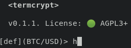

# termcrypt


A terminal-like interface for efficiently trading the market.

Planned Exchanges termcrypt currently supports:

- [x] FTX
- [ ] Bybit

Right now the project is in very early development, so to test it you will most likely have to clone the source and will have to follow the steps on the build section below. 

We hope you enjoy termcrypt :)

[Our plans for features and fixes](https://github.com/termcrypt/termcrypt/projects).

### Documentation

For more information on what termcrypt can do and commands, visit [termcrypt.github.io](https://termcrypt.github.io)

If you would like to contribute to documentation, visit [our docs repo](https://github.com/termcrypt/termcrypt.github.io).

### Features

termcrypt has many utilities that are growing day by day that help interact with the market. Some of the features include:

- Multiple exchange support (in future)
- Fast Speed (Only delays are API requests)
- Order with risk-ordersize calculations
- Subaccounts

For a more comprehensive list, run `help` or `h` inside of termcrypt.



### License

As developers, we believe that accountability leads to credibility and without the codebase being open, others cannot gain full trust. In addition, proprietary software does not allow external creativity and contribution which stunts unfunded smaller projects. We also believe that there should be no barrier to to market and it should be free for everybody no matter their current financial circumstances.

Because of this, we chose the AGPL-3.0-or-later license because it is one of the strongest copyleft licenses available.

**The APGL-3+ requires that termcrypt can not be used in any proprietary solution.**

### Contributing
If you want to open a pull request, you need to follow the instructions in CONTRIBUTING.md

### Build
Following commands require `git`, `rustc` and `cargo`

Clone the repo and open the directory:
```sh
git clone [repo url] termcrypt
cd termcrypt
```

Run / Build (for your os) with cargo:
```sh
cargo run
cargo build
```

Build files will be located in `target/debug`
